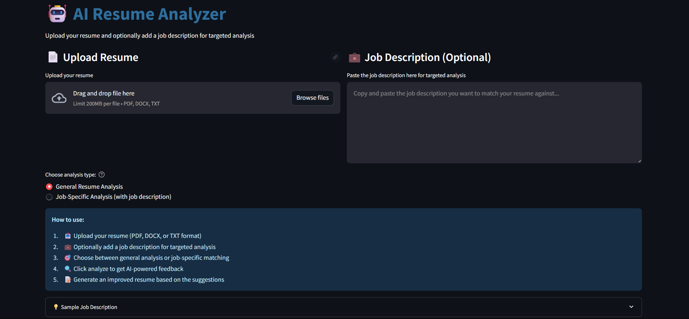

# 🤖 AI Resume Analyzer

AI Resume Analyzer is a smart web app built with **Python**, **Streamlit**, and **Gemini API** that helps users improve their resumes using AI. It analyzes uploaded resumes and provides **personalized feedback**, **job recommendations**, and even generates an **improved resume** based on suggestions.

🌐 **Live Demo**: https://ai-resume-analyzer-puqpqqcgmze6q9zvasczsw.streamlit.app/

---

## 🚀 Features

- Upload resumes in PDF, DOCX, or TXT format.
- Extracts text using intelligent parsers.
- AI-powered analysis with Gemini API.
- Highlights resume strengths and areas for improvement.
- Suggests relevant job roles based on resume content.
- One-click **Download Improved Resume** as PDF.
- Clean and responsive UI with Streamlit.

---

## 🧠 Tech Stack

- [Python](https://www.python.org/)
- [Streamlit](https://streamlit.io/)
- [Google Gemini API](https://ai.google.dev/)
- [python-docx](https://pypi.org/project/python-docx/)
- [PyPDF2](https://pypi.org/project/PyPDF2/)
- [dotenv](https://pypi.org/project/python-dotenv/)

---

## 📸 Screenshots

| Upload Resume | Resume Analysis |
|---------------|------------------|
|  |  |


---

## 🛠️ Installation & Setup

1. **Clone the repository:**
   ```bash
   git clone https://github.com/Arnab-1869/ai-resume-analyzer.git
   cd ai-resume-analyzer
